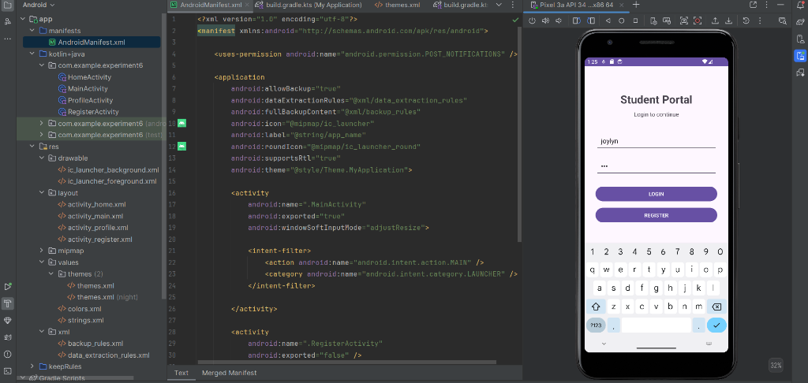
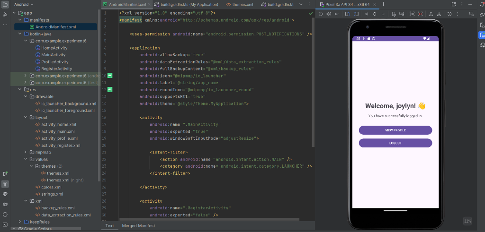
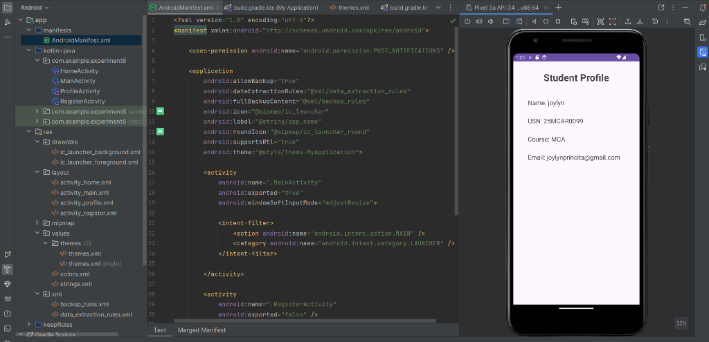
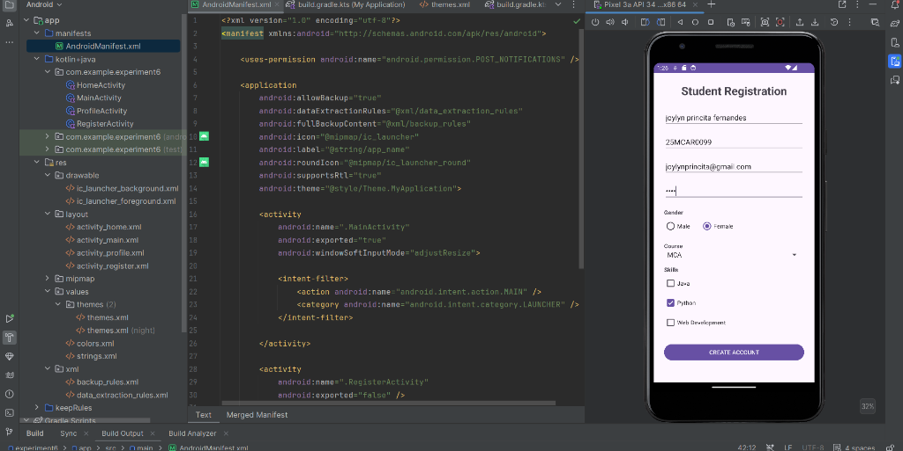

# Student Portal & Registration - Android App (Experiment 6)

A comprehensive Android application built using **Kotlin** and **Android Studio**, showcasing multi-activity navigation, Explicit Intents, parameter passing between activities, form validation, and interactive UI controls (`EditText`, `Button`, `RadioGroup`, `Spinner`, `CheckBox`, `AlertDialog`).

---

## 📱 Application Screenshots

<div align="center">

| Student Login | Home Dashboard | Student Profile |
|:---:|:---:|:---:|
|  |  |  |

| Registration Form | Registration Confirmation |
|:---:|:---:|
|  |  |

</div>

---

## ✨ Features & Functionality

### 1. 🔑 Student Login (`MainActivity.kt`)
* **User Authentication Interface**: Allows students to enter their username and password to log in.
* **Input Validation**: Displays a `Toast` notification if either field is left empty.
* **Explicit Intent & Data Passing**: On successful login, displays an `AlertDialog` confirmation and navigates to `HomeActivity` while passing the `USERNAME` extra.
* **Navigation to Registration**: Provides a direct "REGISTER" button to launch `RegisterActivity`.

### 2. 🏠 Home Dashboard (`HomeActivity.kt`)
* **Personalized Greeting**: Dynamically receives and displays the logged-in student's username.
* **Profile Navigation**: Includes a **"VIEW PROFILE"** button to open the student's profile page.
* **Logout Functionality**: Features a **"LOGOUT"** button that clears the activity stack (`FLAG_ACTIVITY_CLEAR_TOP`) and returns the user safely to the Login screen.

### 3. 👤 Student Profile (`ProfileActivity.kt`)
* **Profile Overview**: Displays detailed student information including Name, USN (University Seat Number), Course, and Email address.

### 4. 📝 Student Registration (`RegisterActivity.kt`)
* **Comprehensive Registration Form**:
  * **Text Fields (`EditText`)**: Collects Full Name, USN, Email ID, and Password.
  * **Gender Selection (`RadioGroup` / `RadioButton`)**: Allows selecting Male or Female options.
  * **Course Selection (`Spinner`)**: Dropdown selection menu featuring options like MCA, MBA, BCA, and B.Tech.
  * **Skills Selection (`CheckBox`)**: Multi-select options for Java, Python, and Web Development.
* **Form Validation**: Checks that all required input fields are populated prior to submission.
* **Confirmation Dialog (`AlertDialog`)**: Displays a summary modal with all captured registration parameters (Name, USN, Course, Selected Skills) upon successful submission.

---

## 🛠️ Project Structure & Architecture

```text
app/src/main/
├── java/com/example/experiment6/
│   ├── MainActivity.kt        # Login screen & app entry point
│   ├── HomeActivity.kt        # Dashboard screen showing welcome message & options
│   ├── ProfileActivity.kt     # Displays student profile details
│   └── RegisterActivity.kt    # Registration form with Spinners, CheckBoxes & RadioButtons
└── res/
    ├── layout/
    │   ├── activity_main.xml       # UI layout for Login
    │   ├── activity_home.xml       # UI layout for Home Dashboard
    │   ├── activity_profile.xml    # UI layout for Profile view
    │   └── activity_register.xml   # UI layout for Registration form
    ├── values/
    │   ├── colors.xml              # Custom app palette
    │   └── strings.xml             # Resource strings
    └── drawable/                   # UI backgrounds and vectors
```

---

## 🚀 How to Run the Project

1. **Clone the Repository**:
   ```bash
   git clone -b exp6 https://github.com/joylynprincita-ai/Android-studio-.git
   ```
2. **Open in Android Studio**:
   - Launch **Android Studio**.
   - Select **Open an existing project** and choose the cloned directory (`experiment6`).
3. **Gradle Sync & Build**:
   - Wait for Android Studio to sync the Gradle project dependencies.
4. **Run Application**:
   - Connect an Android Device via USB debugging or start an Android Virtual Device (AVD / Emulator).
   - Click the **Run (▶)** button or press `Shift + F10`.

---

## 💻 Tech Stack & Tools

* **Language**: Kotlin
* **IDE**: Android Studio
* **UI Components**: XML Layouts, Material Design Components (`AppCompatActivity`, `ConstraintLayout`, `EditText`, `Spinner`, `RadioGroup`, `CheckBox`, `AlertDialog`)
* **Build System**: Gradle (Kotlin DSL)
