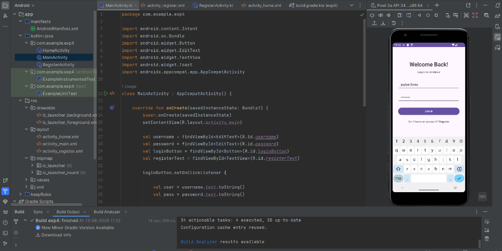
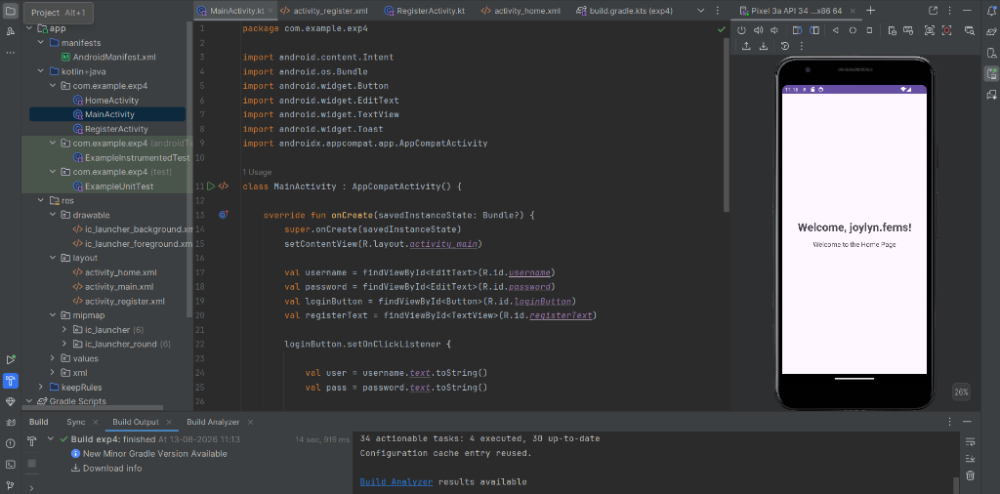
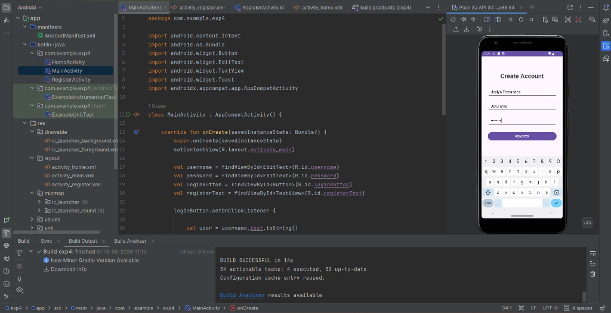
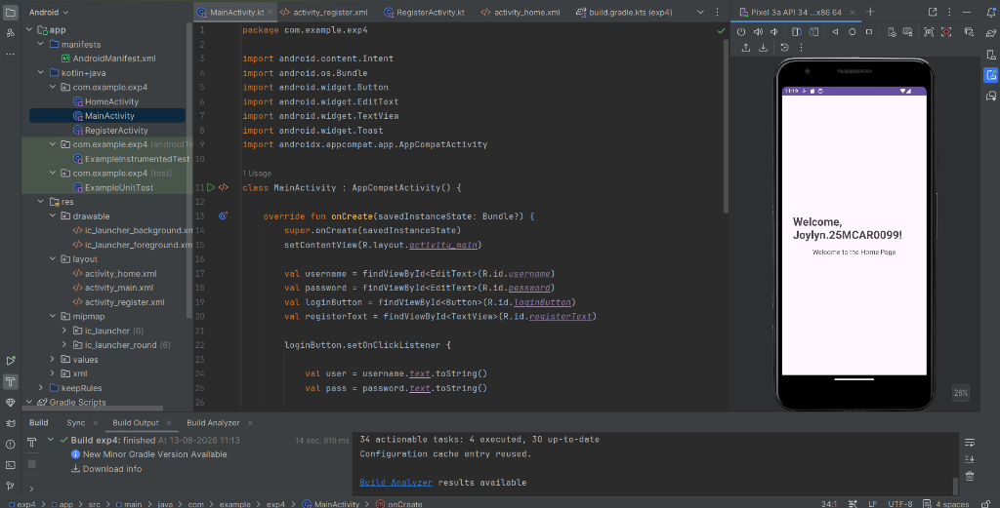
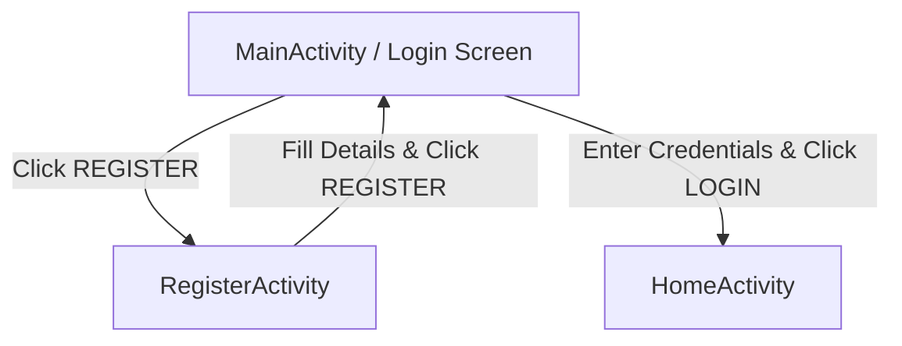

# Experiment 4: Android User Authentication & Navigation App

An Android application built with **Kotlin** and **Android Studio** that demonstrates multi-activity user authentication flow, form validation, dynamic intent extra passing, and seamless user interface transitions.

---

## 📱 Features

- 🔐 **User Login (`MainActivity`)**: Allows users to enter their credentials (Username and Password). Includes validation to prevent blank submission and navigates to the Home dashboard upon entry.
- 📝 **User Registration (`RegisterActivity`)**: Enables new users to create an account by filling in Full Name, Username, and Password with validation check Toast notifications.
- 🏠 **Personalized Home Dashboard (`HomeActivity`)**: Displays a customized welcome screen receiving user data dynamically via Android `Intent` extras.
- 🎨 **Clean UI Design**: Styled using linear layouts, custom input fields, and material design buttons.

---

## 📸 Screenshots

| 1. Login Screen | 2. Home Dashboard (User 1) |
| :---: | :---: |
|  |  |
| *Login interface with credential inputs* | *Personalized home screen after login* |

| 3. Create Account / Register | 4. Home Dashboard (User 2) |
| :---: | :---: |
|  |  |
| *Registration screen for new users* | *Home screen updated with new registered user* |

---

## 🛠️ App Architecture & Navigation Flow



### Activity Components:

1. **`MainActivity.kt`**:
   - Primary launcher activity.
   - Binds `EditText` fields for `username` and `password`.
   - Validates user input with `Toast` error feedback if fields are empty.
   - Launches `HomeActivity` with `intent.putExtra("USERNAME", user)`.
   - Redirects to `RegisterActivity` when "Don't have an account? Register" is clicked.

2. **`RegisterActivity.kt`**:
   - Registration screen for new accounts.
   - Binds `registerName`, `registerUsername`, and `registerPassword`.
   - Validates all input fields before displaying a successful registration toast and finishing the activity to return to login.

3. **`HomeActivity.kt`**:
   - Reads user parameters from `intent.getStringExtra("USERNAME")`.
   - Updates the UI `welcomeText` dynamically (`Welcome, <username>!`).

---

## 📁 Project Structure

```
exp4/
├── app/
│   ├── src/
│   │   ├── main/
│   │   │   ├── java/com/example/exp4/
│   │   │   │   ├── MainActivity.kt        # Login Activity Logic
│   │   │   │   ├── RegisterActivity.kt    # Registration Activity Logic
│   │   │   │   └── HomeActivity.kt        # Home Dashboard Logic
│   │   │   ├── res/
│   │   │   │   ├── layout/
│   │   │   │   │   ├── activity_main.xml     # Login Screen Layout
│   │   │   │   │   ├── activity_register.xml # Register Screen Layout
│   │   │   │   │   └── activity_home.xml     # Home Screen Layout
│   │   │   │   └── values/
│   │   │   └── AndroidManifest.xml
│   └── build.gradle.kts
├── screenshots/
│   ├── 01_login_screen.png
│   ├── 02_home_screen_user1.png
│   ├── 03_register_screen.png
│   └── 04_home_screen_user2.png
├── build.gradle.kts
├── settings.gradle.kts
└── README.md
```

---

## 💻 Tech Stack & Requirements

- **Language**: Kotlin
- **Min SDK**: API Level 24 (Android 7.0)
- **Target SDK**: API Level 36 / 37
- **UI Components**: `AppCompatActivity`, `LinearLayout`, `EditText`, `Button`, `TextView`, `Toast`
- **IDE**: Android Studio

---

## 🚀 How to Run the Project

1. Clone or download the repository:
   ```bash
   git clone https://github.com/joylynprincita-ai/Android-studio-.git -b exp4
   ```
2. Open **Android Studio**.
3. Select **Open an Existing Project** and navigate to the `exp4` directory.
4. Allow Gradle to sync dependencies automatically.
5. Select an Emulator (e.g., Pixel 3a API 34) or connect a physical Android device.
6. Click **Run** (`Shift + F10`) to build and launch the application.

---

## 👤 Author
Developed by **Joylyn** (`joylynprincita-ai`)
