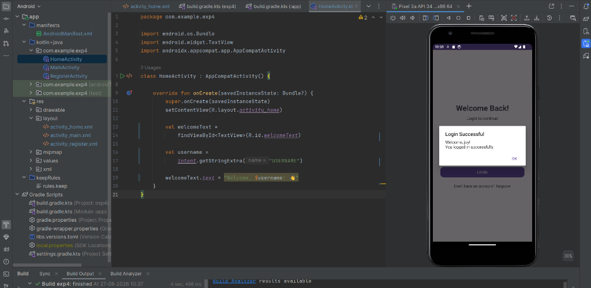
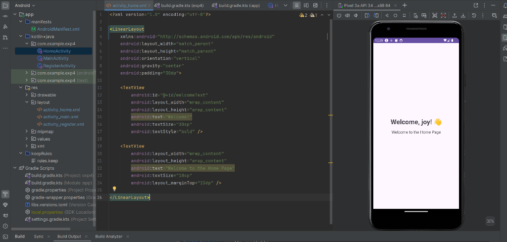
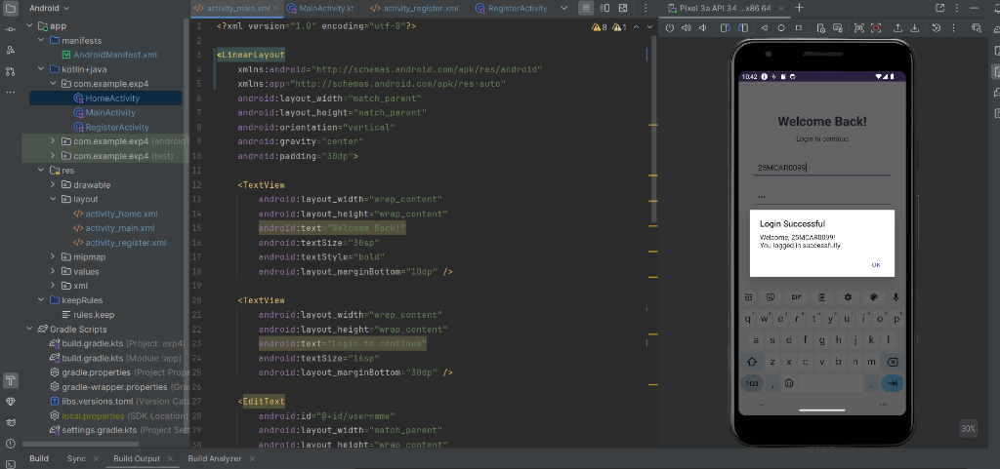
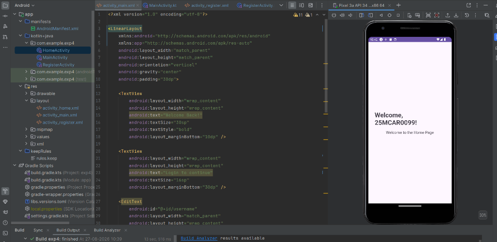
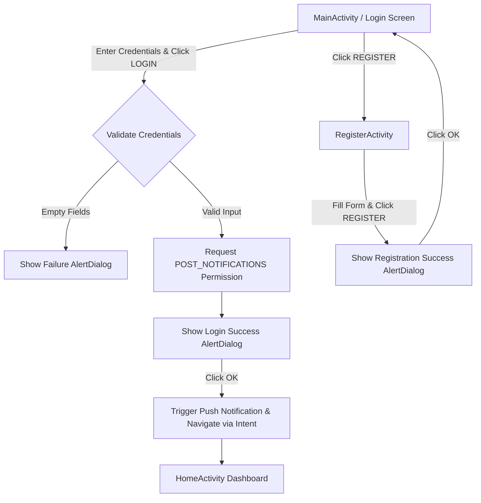

# Experiment 5: Android User Authentication, Alert Dialogs & System Notifications

An Android application built with **Kotlin** and **Android Studio** demonstrating multi-activity user authentication flow, form validation, dynamic intent extra passing, interactive `AlertDialog` popups, and Android system push notifications using `NotificationChannel` and `NotificationCompat`.

---

## 📱 Features

- 🔐 **User Authentication (`MainActivity`)**:
  - Validates user input (Username and Password).
  - Displays interactive `AlertDialog` popups for **Login Successful** and **Login Failed**.
  - Dynamically triggers system-level push notifications upon successful authentication.
  - Passes user credentials dynamically via explicit Android `Intent` extra to the Home Dashboard.

- 🔔 **Android 13+ Notification Handling**:
  - Creates a dedicated `NotificationChannel` ("Login Notifications") for Android O+.
  - Requests runtime permission `POST_NOTIFICATIONS` on Android 13 (Tiramisu) or higher.
  - Builds and posts system tray notifications using `NotificationCompat.Builder` and `NotificationManagerCompat`.

- 📝 **Account Registration (`RegisterActivity`)**:
  - Handles new user registration (Full Name, Username, Password).
  - Provides `AlertDialog` validation for incomplete fields and confirmation popups upon successful registration.

- 🏠 **Personalized Home Dashboard (`HomeActivity`)**:
  - Receives the username from `Intent.getStringExtra("USERNAME")`.
  - Displays a customized welcome greeting (`Welcome, <username>! 👋 Welcome to the Home Page`).

---

## 📸 Screenshots

| 1. Notification Permission Prompt | 2. Login Alert Dialog (User 1) |
| :---: | :---: |
|  |  |
| *Runtime POST_NOTIFICATIONS permission prompt on Android 13+* | *Login Successful AlertDialog popup for user 'joy'* |

| 3. Home Dashboard (User 1) | 4. Login Alert Dialog (User 2) |
| :---: | :---: |
|  |  |
| *Personalized Home Screen displaying welcome message for 'joy'* | *Login Successful AlertDialog popup for student ID '25MCAR0099'* |

| 5. Home Dashboard (User 2) |
| :---: |
|  |
| *Personalized Home Screen displaying welcome message for '25MCAR0099'* |

---

## 🛠️ App Architecture & Flow



### Key Components:

1. **`MainActivity.kt`**:
   - Manages login interface, `NotificationChannel` initialization (`login_channel`), runtime notification permission requests, `AlertDialog` prompt displays, push notification dispatching, and explicit `Intent` navigation to `HomeActivity`.
2. **`HomeActivity.kt`**:
   - Extracts `USERNAME` extra from `Intent` and renders a personalized welcome greeting.
3. **`RegisterActivity.kt`**:
   - Collects user registration fields, displays validation/confirmation dialogs, and returns to the login screen upon completion.
4. **`AndroidManifest.xml`**:
   - Declares `android.permission.POST_NOTIFICATIONS` for system notifications.

---

## 📁 Project Structure

```
exp4/
├── app/
│   ├── src/
│   │   ├── main/
│   │   │   ├── java/com/example/exp4/
│   │   │   │   ├── MainActivity.kt        # Login Activity with AlertDialog & Notification Logic
│   │   │   │   ├── RegisterActivity.kt    # Registration Activity Logic
│   │   │   │   └── HomeActivity.kt        # Home Dashboard Logic
│   │   │   ├── res/
│   │   │   │   ├── layout/
│   │   │   │   │   ├── activity_main.xml     # Login Screen Layout
│   │   │   │   │   ├── activity_register.xml # Register Screen Layout
│   │   │   │   │   └── activity_home.xml     # Home Screen Layout
│   │   │   │   └── values/
│   │   │   └── AndroidManifest.xml       # Manifest with POST_NOTIFICATIONS permission
│   └── build.gradle.kts
├── screenshots/
│   ├── 01_notification_permission.png
│   ├── 02_login_success_alert.png
│   ├── 03_home_dashboard.png
│   ├── 04_login_success_alert_user2.png
│   └── 05_home_dashboard_user2.png
├── build.gradle.kts
├── settings.gradle.kts
└── README.md
```

---

## 💻 Tech Stack & Requirements

- **Language**: Kotlin
- **Min SDK**: API Level 24 (Android 7.0)
- **Target SDK**: API Level 36 / 37
- **Key APIs**: `AlertDialog`, `NotificationChannel`, `NotificationCompat`, `NotificationManagerCompat`, `Intent`
- **Permissions**: `android.permission.POST_NOTIFICATIONS`
- **IDE**: Android Studio

---

## 🚀 How to Run the Project

1. Clone the repository and switch to `exp5` branch:
   ```bash
   git clone https://github.com/joylynprincita-ai/Android-studio-.git -b exp5
   ```
2. Open **Android Studio**.
3. Select **Open an Existing Project** and navigate to the project directory.
4. Allow Gradle to sync dependencies automatically.
5. Launch an Emulator (e.g., Pixel 3a API 34+) or connect a physical Android device.
6. Click **Run** (`Shift + F10`) to build and launch the application.

---

## 👤 Author
Developed by **Joylyn** (`joylynprincita-ai`)
