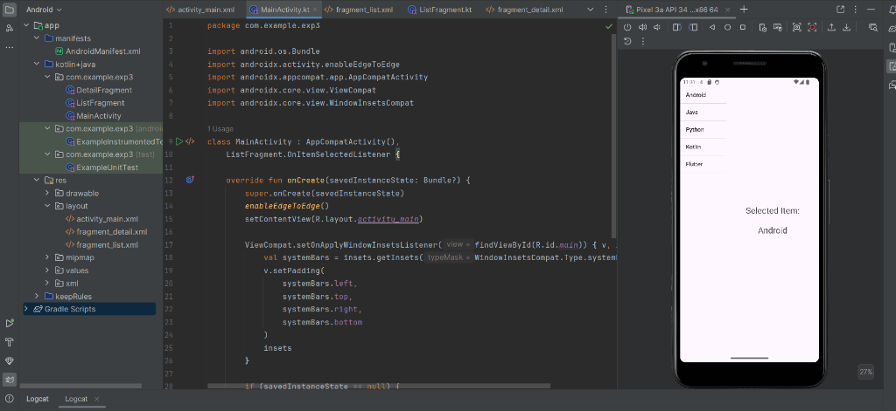
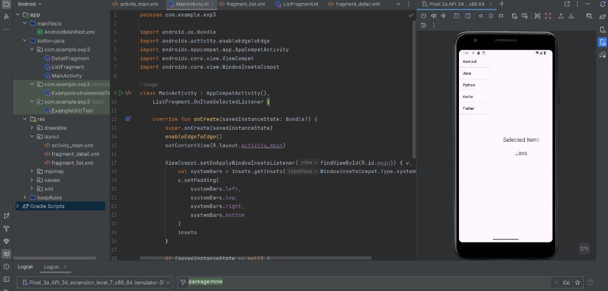
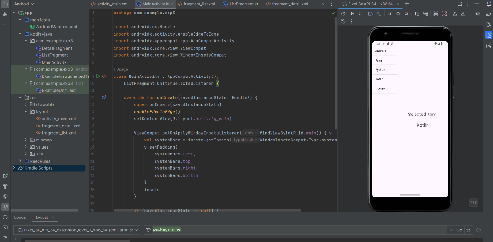

# Experiment 3: Fragment Master-Detail Interface (exp3)

An Android application built with Kotlin and Android Jetpack Components demonstrating **Master-Detail Flow using Fragments** and **Inter-Fragment Communication** via interface callbacks.

---

## 📱 Features

- **Master-Detail Layout**: Splits the user interface into a selection list container (`ListFragment`) and a detail display container (`DetailFragment`).
- **Dynamic Fragment Management**: Uses `FragmentManager` and `FragmentTransaction` to dynamically replace and render fragments without reloading the activity.
- **Callback Communication Pattern**: Employs a custom interface (`OnItemSelectedListener`) implemented by `MainActivity` to safely pass data between decoupled fragments.
- **Responsive Layout**: Designed using a horizontal `LinearLayout` layout weight ratio for optimal side-by-side display of the list and detail views.

---

## 📸 Screenshots & Output

Below are the execution screenshots of the app running on Pixel 3a Emulator demonstrating selection changes:

| 1. Item Selected: "Android" | 2. Item Selected: "Java" | 3. Item Selected: "Kotlin" |
| :-------------------------: | :----------------------: | :------------------------: |
|  |  |  |

---

## 🛠️ Project Structure & Architecture

```text
exp3/
├── app/
│   ├── src/
│   │   └── main/
│   │       ├── java/com/example/exp3/
│   │       │   ├── MainActivity.kt        # Hosts fragment containers & implements OnItemSelectedListener callback
│   │       │   ├── ListFragment.kt        # Displays ListView of technologies & notifies listener on click
│   │       │   └── DetailFragment.kt      # Receives selected item via Fragment arguments & displays details
│   │       └── res/
│   │           └── layout/
│   │               ├── activity_main.xml    # Container layout holding listContainer & detailContainer
│   │               ├── fragment_list.xml    # ListView component structure
│   │               └── fragment_detail.xml  # TextView component for displaying selected item text
├── screenshots/
│   ├── screenshot1_android.png
│   ├── screenshot2_java.png
│   └── screenshot3_kotlin.png
├── README.md
├── build.gradle.kts
└── settings.gradle.kts
```

---

## ⚙️ Key Component Breakdown

### 1. `MainActivity.kt`
- Implements `ListFragment.OnItemSelectedListener`.
- Loads `ListFragment` into `R.id.listContainer` upon initial launch (`savedInstanceState == null`).
- When `onItemSelected(item)` is triggered, creates a `DetailFragment` instance using `newInstance(item)` and replaces `R.id.detailContainer`.

### 2. `ListFragment.kt`
- Populates an `ArrayAdapter` with technology options: `["Android", "Java", "Python", "Kotlin", "Flutter"]`.
- Attaches to `MainActivity` via `onAttach(context)` to bind the `OnItemSelectedListener`.
- Triggers `listener.onItemSelected(items[position])` on item click.

### 3. `DetailFragment.kt`
- Uses the `newInstance(item: String)` factory method pattern to bundle parameters into arguments.
- Extracts `item` string during `onCreate` and displays `"Selected Item:\n\n$item"` inside `R.id.txtDetails`.

---

## 🚀 Getting Started

### Prerequisites
- **Android Studio**: Ladybug / Jellyfish / Hedgehog or newer
- **JDK**: Java 17 or higher
- **Android SDK**: API Level 34 / 35 (Android 14 / 15)

### Build & Run
1. Clone the repository:
   ```bash
   git clone -b exp3 https://github.com/joylynprincita-ai/Android-studio-.git
   cd Android-studio-
   ```
2. Open the project in **Android Studio**.
3. Sync Gradle assets and press **Run** (`Shift + F10`) on an active Android Emulator or physical device.

---

## 🏷️ Branch Information
This experiment is hosted on branch: `exp3` in [joylynprincita-ai/Android-studio-](https://github.com/joylynprincita-ai/Android-studio-/tree/exp3).
