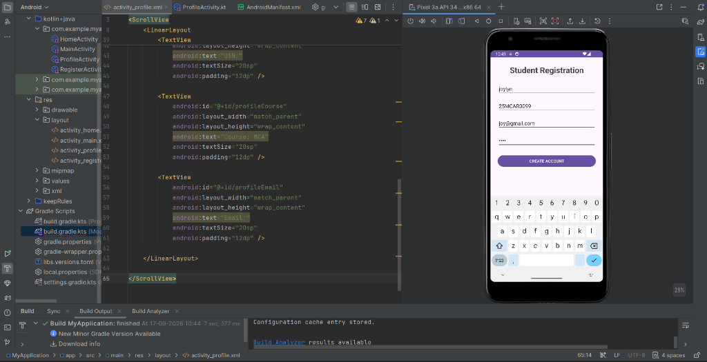
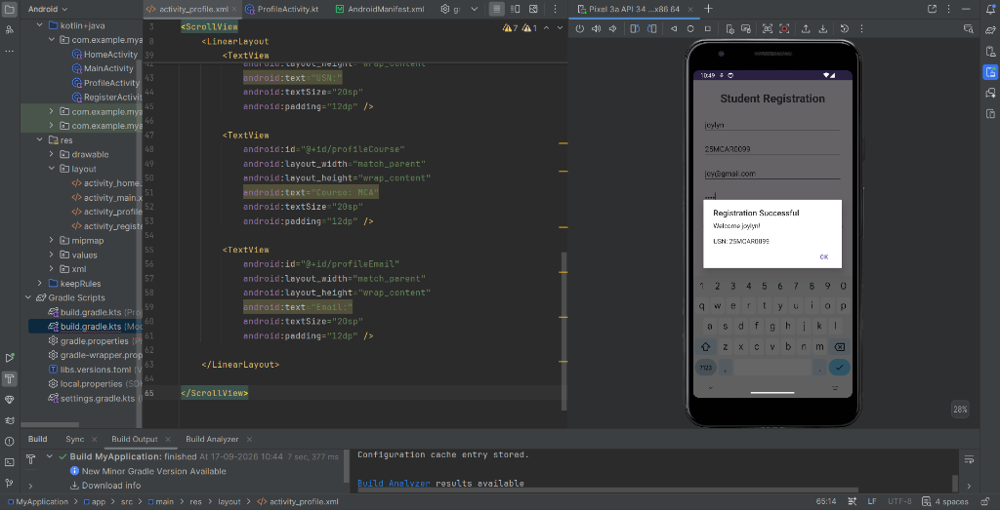
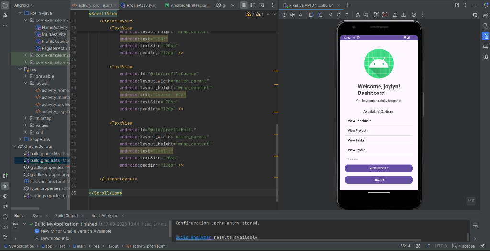
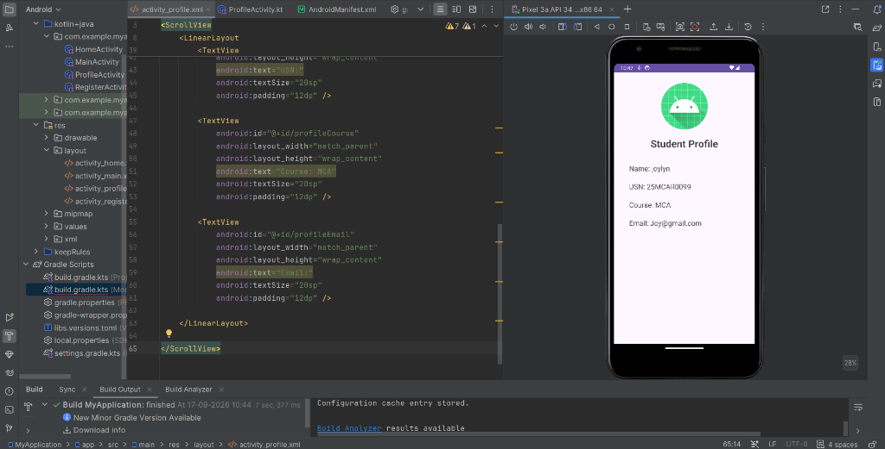

# Student Portal Android Application (Experiment 7)

An Android application developed using **Kotlin** and **Android Studio**, demonstrating user authentication, explicit activity navigation using Android `Intent`s, dynamic `ListView` menus, `AlertDialog` notifications, and profile details rendering.

## 👤 Author & Owner
- **joylynprincita** (`joylynprincita-ai`) - Sole Author & Project Owner

---

## 📱 Features

- **Student Registration (`RegisterActivity`)**:
  - Registration form collecting student details: Name, USN, Email, and Password.
  - Form validation with `AlertDialog` feedback.
  - Successful registration popup confirmation with student details.

- **Student Login (`MainActivity`)**:
  - Secure login interface requiring Username and Password.
  - Form validation ensuring non-empty inputs.
  - Interactive login success `AlertDialog` leading to the main Dashboard via Explicit Intent with username payload (`intent.putExtra`).

- **Student Dashboard (`HomeActivity`)**:
  - Personalized welcome message dynamically generated based on logged-in user.
  - Interactive `ListView` with options:
    - View Dashboard
    - View Projects
    - View Tasks
    - View Profile
  - Direct action buttons for viewing Profile and Logging Out.

- **Student Profile (`ProfileActivity`)**:
  - Displays complete student profile details: Name, USN, Course, and Email address.

---

## 📸 Application Screenshots & Workflow

### 1. Student Registration & Confirmation
| Registration Form | Registration Success Alert |
| :---: | :---: |
|  |  |
| *Student Registration interface with input fields* | *Dialog displaying welcome message & USN* |

<br/>

### 2. Student Login & Authentication
| Login Interface & Success Dialog |
| :---: |
|  |
| *Login screen validating credentials with success dialog* |

<br/>

### 3. Student Dashboard & Navigation
| Home Dashboard |
| :---: |
|  |
| *Interactive Dashboard with options menu and navigation* |

<br/>

### 4. Student Profile View
| Student Profile Screen |
| :---: |
|  |
| *Profile layout showing Name, USN (25MCAR0099), Course (MCA), & Email* |

---

## 🛠️ Technology Stack & Tools

- **Language**: Kotlin
- **IDE**: Android Studio
- **UI Components**: XML Layouts, ScrollView, LinearLayout, EditText, Button, TextView, ListView
- **Android Architecture / APIs**: `AppCompatActivity`, `Intent` (Explicit & Extra Payload), `AlertDialog.Builder`, `ArrayAdapter`
- **Target SDK**: Android API 34

---

## 🚀 How to Run the Project

1. **Clone the Repository**:
   ```bash
   git clone https://github.com/joylynprincita-ai/Android-studio-.git
   cd Android-studio-
   git checkout exp7
   ```
2. **Open in Android Studio**:
   - Open Android Studio and choose **File > Open**.
   - Navigate to the cloned repository directory and select it.
3. **Build & Run**:
   - Sync Gradle files.
   - Run the application on an Android Virtual Device (AVD) or connected Android physical device.

---

## 📄 License
Created and maintained by **joylynprincita**. All rights reserved.
