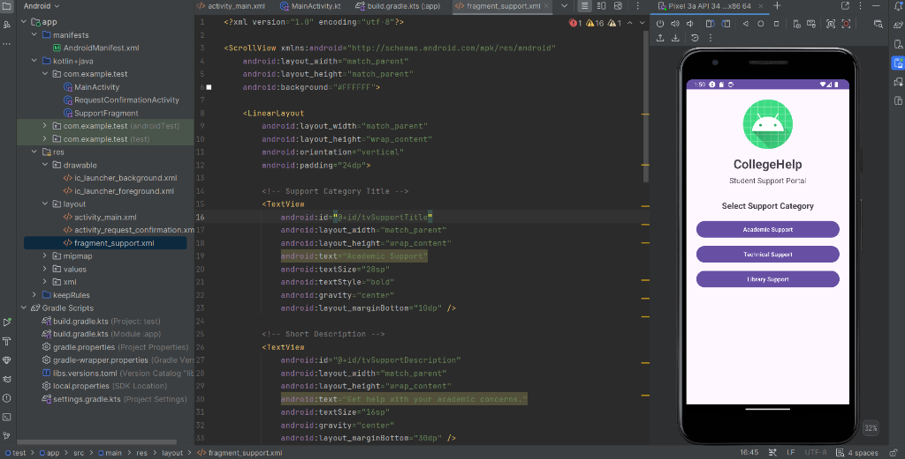
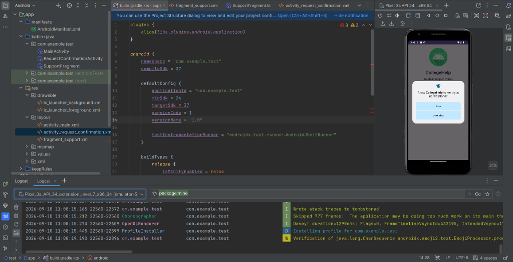
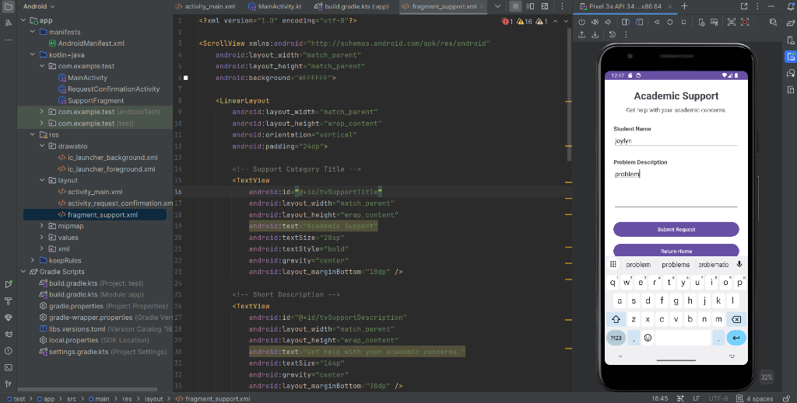
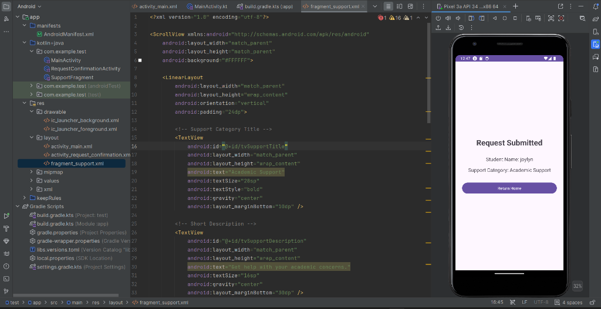
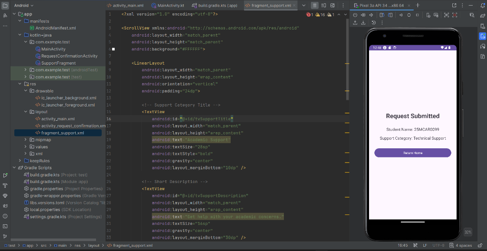

# CollegeHelp - Student Support Portal

An Android application demonstrating **Activity Lifecycle**, **Fragments**, **Explicit Intents**, and **System Notifications** with runtime permissions in Kotlin.

**Author**: Joylyn  
**USN**: 25MCAR0099  
**Repository**: [https://github.com/joylynprincita-ai/Android-studio-/tree/test](https://github.com/joylynprincita-ai/Android-studio-/tree/test)

---

## 📖 Table of Contents
1. [Overview & Experiment Description](#-overview--experiment-description)
2. [Concepts & Underlying Technologies](#-concepts--underlying-technologies)
3. [Demonstrated Scenario](#-demonstrated-scenario)
4. [Project Folder & File Structure](#-project-folder--file-structure)
5. [Main Application Output](#-main-application-output)
6. [Test Cases & Screenshots](#-test-cases--screenshots)

---

## 📌 Overview & Experiment Description

The **CollegeHelp** application serves as a student support ticket system designed to showcase core Android architectural components and best practices. 

The experiment demonstrates:
- Single-Activity hosting with dynamic **Fragment transactions** (`SupportFragment`).
- Navigation and screen swapping using frame visibility controls and `onBackPressed` backstack management.
- Multi-Activity transition passing bundle data using explicit **Intents**.
- **Activity Lifecycle** tracking across lifecycle states (`onCreate`, `onStart`, `onResume`, `onPause`, `onStop`, `onDestroy`).
- **Android 13+ Notification System** integration including runtime permissions (`POST_NOTIFICATIONS`) and `NotificationChannel` management.

---

## ⚙️ Concepts & Underlying Technologies

### 1. Android Activity Lifecycle & State Logging
- `MainActivity` and `RequestConfirmationActivity` override lifecycle callbacks to log state transitions via `Log.d("CollegeHelp", ...)`:
  - `onCreate()`: Initializes views, registers listeners, and sets up notification channels.
  - `onStart()` / `onResume()`: Handles activity visibility and user interaction readiness.
  - `onPause()` / `onStop()` / `onDestroy()`: Manages state preservation and cleanup.

### 2. Modular UI with Fragments
- **`SupportFragment`**: Built as a reusable UI component that inflates `fragment_support.xml`.
- **Fragment Management**: `MainActivity` uses `supportFragmentManager.beginTransaction().replace(...)` to dynamically swap screens without restarting activities, adding fragments to the backstack.

### 3. Explicit Intents & Data Transfer
- Communication between `SupportFragment` and `RequestConfirmationActivity` is implemented via explicit `Intent`:
  ```kotlin
  val intent = Intent(requireContext(), RequestConfirmationActivity::class.java)
  intent.putExtra("studentName", name)
  intent.putExtra("category", category)
  startActivity(intent)
  ```

### 4. System Notifications & Runtime Permission Handling (Android 13+ / API 33+)
- **Notification Channel**: Registers `"college_help_channel"` with `IMPORTANCE_DEFAULT` required on Android 8.0+.
- **Runtime Permissions**: Uses `ActivityResultContracts.RequestPermission()` to dynamically prompt the user for `Manifest.permission.POST_NOTIFICATIONS`.
- **Notification Dispatch**: Uses `NotificationCompat.Builder` with `BigTextStyle` to display detailed request submission confirmations.

---

## 🎓 Demonstrated Scenario

### Scenario: College Support Ticket Submission
1. **Home Screen**: A student opens **CollegeHelp - Student Support Portal** and selects one of three support categories:
   - **Academic Support**
   - **Technical Support**
   - **Library Support**
2. **Dynamic Form Entry**: Selecting a category loads the `SupportFragment`, displaying tailored guidance. The student enters their **Name** or **USN** and a **Problem Description**.
3. **Validation & Intent Dispatch**: Input validation ensures the student name/USN field is non-empty. Clicking **Submit Request** launches `RequestConfirmationActivity`.
4. **Confirmation & Notification**: The app displays the confirmation details on screen and dispatches a system notification confirming the request submission.

---

## 📂 Project Folder & File Structure

```
test/
├── app/
│   ├── build.gradle.kts
│   └── src/
│       └── main/
│           ├── AndroidManifest.xml
│           ├── java/com/example/test/
│           │   ├── MainActivity.kt
│           │   ├── SupportFragment.kt
│           │   └── RequestConfirmationActivity.kt
│           └── res/
│               ├── layout/
│               │   ├── activity_main.xml
│               │   ├── activity_request_confirmation.xml
│               │   └── fragment_support.xml
│               ├── values/
│               │   ├── colors.xml
│               │   ├── strings.xml
│               │   └── themes.xml
│               └── drawable/
├── screenshots/
│   ├── 01_notification_permission.png
│   ├── 02_home_screen.png
│   ├── 03_support_form_input.png
│   ├── 04_request_confirmation_name.png
│   └── 05_request_confirmation_usn.png
├── build.gradle.kts
├── settings.gradle.kts
└── README.md
```

### Key Files Breakdown:
- **`MainActivity.kt`**: Main entry activity; manages category selection buttons, fragment container visibility, and back stack popping.
- **`SupportFragment.kt`**: Fragment handling user input for student name/USN and issue description, performing form validation, and launching confirmation activity.
- **`RequestConfirmationActivity.kt`**: Displays request summary details, creates notification channels, requests runtime permissions, and posts system notifications.
- **`activity_main.xml`**: Layout containing the home portal UI and the fragment container (`FrameLayout`).
- **`fragment_support.xml`**: Reusable fragment layout with form fields (`EditText`) and submit/return action buttons.
- **`activity_request_confirmation.xml`**: Layout showing confirmation message and request metadata.
- **`AndroidManifest.xml`**: Declares app activities and `POST_NOTIFICATIONS` permission.

---

## 📱 Main Application Output

Below is the output screen of the **CollegeHelp Student Support Portal** showing category selection:



---

## 🧪 Test Cases & Screenshots

### Test Case 1: Initial App Launch & Notification Permission Request
- **Objective**: Verify app startup, notification channel initialization, and system runtime permission prompt (`POST_NOTIFICATIONS`).
- **Preconditions**: App installed on Android 13+ (API level 33+) emulator/device.
- **Test Steps**:
  1. Launch the application.
  2. Observe runtime system permission request for notifications.
- **Expected Result**: System notification permission dialog ("Allow CollegeHelp to send you notifications?") is displayed over the main portal.
- **Screenshot**:

  

---

### Test Case 2: Academic Support Request Submission by Name
- **Objective**: Verify category selection, fragment navigation, form validation, intent extra data transfer, and confirmation screen rendering.
- **Test Steps**:
  1. Launch app and click **Academic Support**.
  2. Enter Student Name: `Joylyn`.
  3. Enter Problem Description: `problem`.
  4. Click **Submit Request**.
- **Expected Result**: Navigates to `RequestConfirmationActivity`, showing `Student Name: Joylyn` and `Support Category: Academic Support` along with a system notification dispatch.
- **Screenshots**:

  | Input Form Screen | Submission Confirmation Screen |
  | :---: | :---: |
  |  |  |

---

### Test Case 3: Technical Support Request Submission using Student USN (`25MCAR0099`)
- **Objective**: Verify support ticket submission utilizing Student USN as the identifier for the Technical Support category.
- **Test Steps**:
  1. Select **Technical Support** from the main menu.
  2. Enter Student Name / USN: `25MCAR0099`.
  3. Click **Submit Request**.
- **Expected Result**: The confirmation screen successfully displays `Student Name: 25MCAR0099` and `Support Category: Technical Support`.
- **Screenshot**:

  

---

## ✒️ Author & Ownership

- **Author Name**: Joylyn
- **USN**: 25MCAR0099
- **GitHub Username**: `joylynprincita-ai`
- **Repository Branch**: `test`

*All code, documentation, and screenshots contained in this project belong strictly to the author.*
