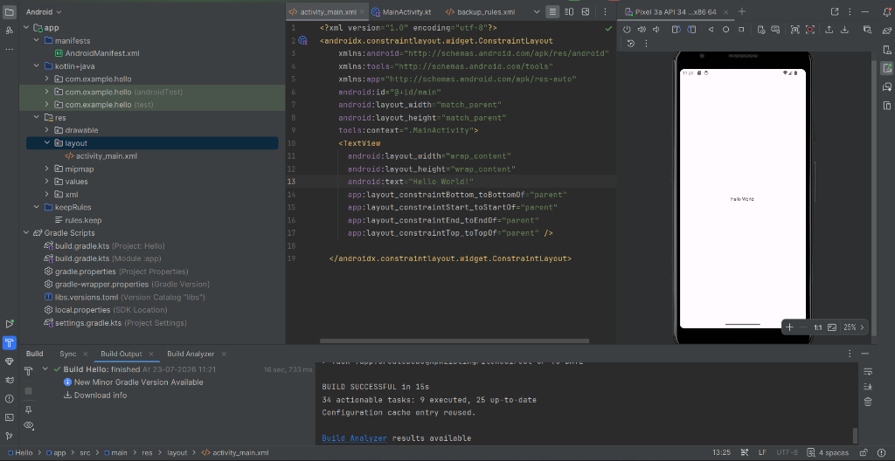
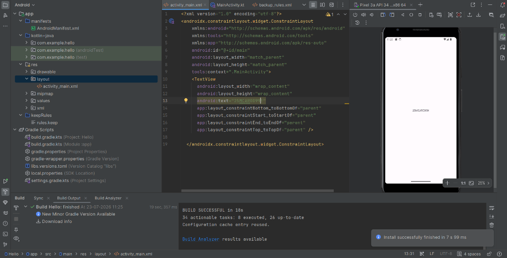

<<<<<<< HEAD
# Android-studio-
=======
# Android Studio - Hello World App 📱

An Android application built using **Kotlin** and **Android Studio**, demonstrating ConstraintLayout design, XML UI customization, and edge-to-edge layout integration on Android emulator (Pixel 3a API 34).

---

## 📌 Project Overview

This project showcases a fundamental Android application setup with Kotlin. It demonstrates updating text dynamically in `activity_main.xml` and running build tasks on an Android Virtual Device (AVD).

### Key Features
- **Modern Kotlin & Jetpack Integration**: Utilizes AndroidX `AppCompatActivity`, `ConstraintLayout`, and `ViewCompat` for modern Android app architecture.
- **Edge-to-Edge Display**: Configured window insets handling for modern Android screen designs.
- **UI Customization**: XML layout (`activity_main.xml`) with ConstraintLayout positioning.
- **Gradle Build System**: Configured with Kotlin DSL (`build.gradle.kts`) and Version Catalogs (`libs.versions.toml`).

---

## 📸 Screenshots & Demonstrations

| Hello World Output | Customized Text: `25MCAR099!` | Customized Text: `anything!` |
| :---: | :---: | :---: |
|  |  |  |

---

## 🛠️ Project Structure

```
Hello/
├── app/
│   ├── src/
│   │   ├── main/
│   │   │   ├── java/com/example/hello/
│   │   │   │   └── MainActivity.kt       # Main Activity logic
│   │   │   ├── res/
│   │   │   │   ├── layout/
│   │   │   │   │   └── activity_main.xml # Layout XML file
│   │   │   │   ├── values/
│   │   │   │   └── mipmap/
│   │   │   └── AndroidManifest.xml       # App Manifest
│   └── build.gradle.kts
├── screenshots/                            # Application screenshots
├── build.gradle.kts                        # Root build configuration
├── settings.gradle.kts                     # Project settings
└── README.md                               # Project documentation
```

---

## 🚀 Getting Started & Setup

### Prerequisites
- **Android Studio** (Koala / Ladybug or newer recommended)
- **JDK 17** or higher
- **Android SDK** API level 34 (or target API configured)

### How to Run

1. **Clone the Repository:**
   ```bash
   git clone https://github.com/joylynprincita-ai/Android-studio-.git
   cd Android-studio-
   ```

2. **Open in Android Studio:**
   - Open Android Studio.
   - Click **Open** and select the cloned project folder.

3. **Sync Gradle:**
   - Allow Android Studio to download dependencies and sync Gradle automatically.

4. **Run the App:**
   - Select an emulator (e.g., Pixel 3a API 34) or a connected physical Android device.
   - Click **Run (Shift + F10)** or the green play button ▶️ in Android Studio.

---

## 📄 License
This project is open-source and available under the [MIT License](LICENSE).
>>>>>>> 0e774f8 (Initial commit: Add Hello World Android project with screenshots and README)
