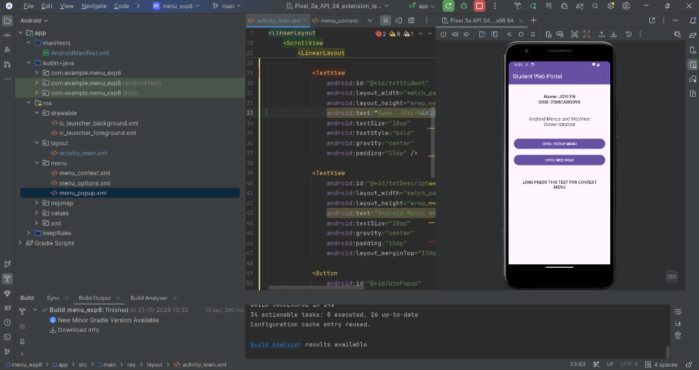
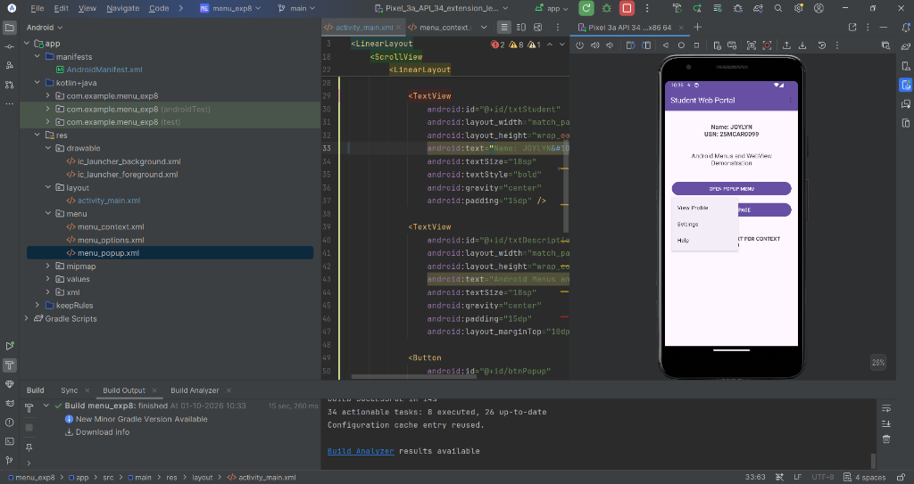
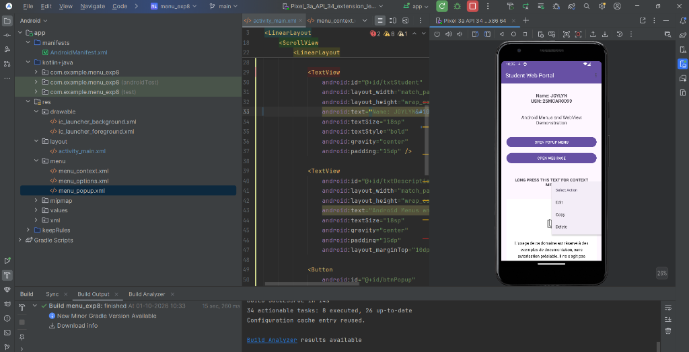

# Experiment 8 - Student Web Portal: Android Menus & WebView App

**Owner & Author:** joylynprincita

An Android application built with **Kotlin** and **Android Studio** demonstrating **3 distinct types of Android Menus** (Options Menu, Context Menu, and Popup Menu) alongside an embedded **WebView** component integrated within a Student Web Portal interface.

---

## 📸 Application Screenshots

| 1. Main Interface & Student Details | 2. Popup Menu View |
| :---: | :---: |
|  |  |
| *Student Web Portal showing Name: JOYLYN, USN: 25MCAR0099 & UI controls* | *Popup Menu anchored to button showing View Profile, Settings & Help* |

| 3. Web Page View | 4. Context Menu View |
| :---: | :---: |
|  |  |
| *Embedded WebView displaying web page content inside app* | *Context Menu displaying Select Action (Edit, Copy, Delete) on long-press* |

---

## 📱 Features & Components

### 🎓 Student Profile Header
- **Name**: `JOYLYN`
- **USN**: `25MCAR0099`
- **Title**: Student Web Portal - Android Menus and WebView Demonstration

### 1. ⚙️ Options Menu (Toolbar Menu)
- **Inflation**: Defined in `res/menu/menu_options.xml` and attached to the Action Bar / Toolbar (`R.id.toolbar`) in `MainActivity.kt`.
- **Menu Items**:
  - 🏠 **Home**: Toast notification confirming selection.
  - 🌐 **Web**: Renders the embedded WebView and loads web content.
  - ℹ️ **About**: Displays project information via Toast.

### 2. 📋 Popup Menu (Button Anchored)
- **Inflation**: Defined in `res/menu/menu_popup.xml`.
- **Trigger**: Click event on the **`OPEN POPUP MENU`** button (`btnPopup`).
- **Menu Items**:
  - 👤 **View Profile**: Profile selection feedback.
  - ⚙️ **Settings**: App settings action.
  - ❓ **Help**: Displays help dialog action.

### 3. 📝 Context Menu (Long-Press Action)
- **Inflation**: Defined in `res/menu/menu_context.xml`.
- **Trigger**: Long-press on the text view **`LONG PRESS THIS TEXT FOR CONTEXT MENU`** (`txtContext`).
- **Header**: "Select Action"
- **Menu Items**:
  - ✏️ **Edit**: Edit item feedback Toast.
  - 📋 **Copy**: Copy item feedback Toast.
  - 🗑️ **Delete**: Delete item feedback Toast.

### 4. 🌐 WebView Integration
- **Trigger**: Click event on **`OPEN WEB PAGE`** button (`btnWebView`) or selecting **Web** in the Options Menu.
- **Configuration**:
  - JavaScript Enabled (`javaScriptEnabled = true`)
  - DOM Storage Enabled (`domStorageEnabled = true`)
  - Inline browsing configured via custom `WebViewClient`.

---

## 🛠️ Project Structure

```text
menu_exp8/
├── app/
│   ├── src/
│   │   └── main/
│   │       ├── java/com/example/menu_exp8/
│   │       │   └── MainActivity.kt
│   │       └── res/
│   │           ├── layout/
│   │           │   └── activity_main.xml
│   │           └── menu/
│   │               ├── menu_context.xml
│   │               ├── menu_options.xml
│   │               └── menu_popup.xml
│   └── build.gradle.kts
├── screenshots/
│   ├── 01_main_interface.png
│   ├── 02_popup_menu.png
│   ├── 03_web_page_view.png
│   └── 04_context_menu.png
├── build.gradle.kts
├── settings.gradle.kts
└── README.md
```

---

## 🚀 How to Run the App

1. Open **Android Studio**.
2. Select **Open** and select the `menu_exp8` project directory.
3. Wait for Gradle sync to complete automatically.
4. Select an active Emulator (e.g. Pixel 3a API 34) or connect a physical Android device.
5. Click **Run 'app'** (`Shift + F10`).

---

**Author & Sole Maintainer**: joylynprincita  
